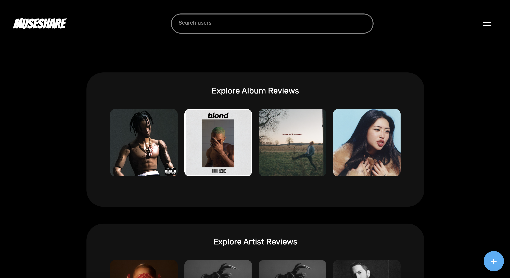
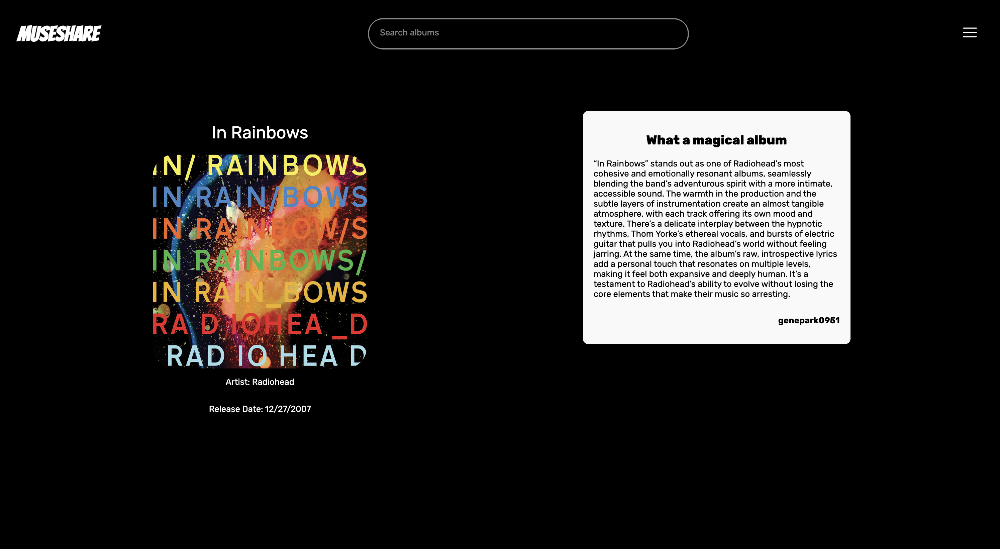
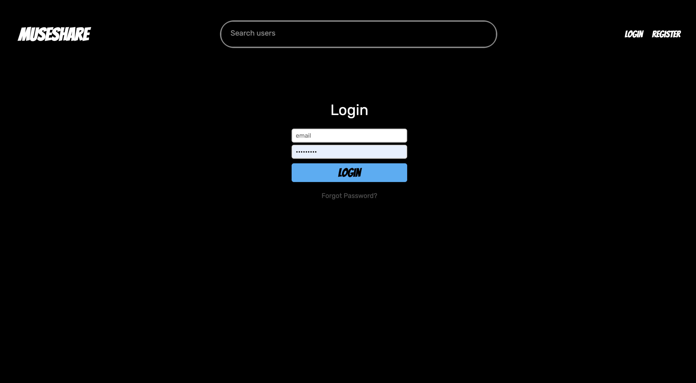
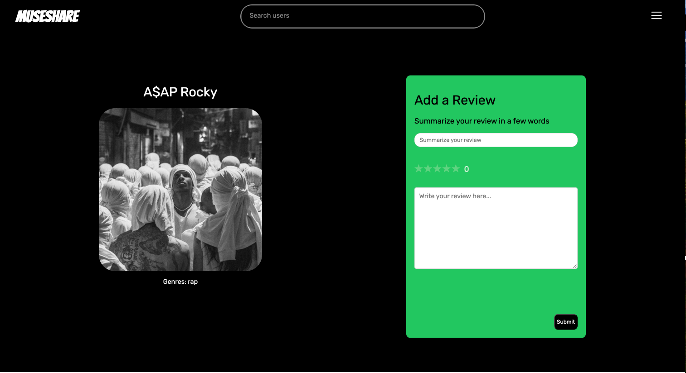
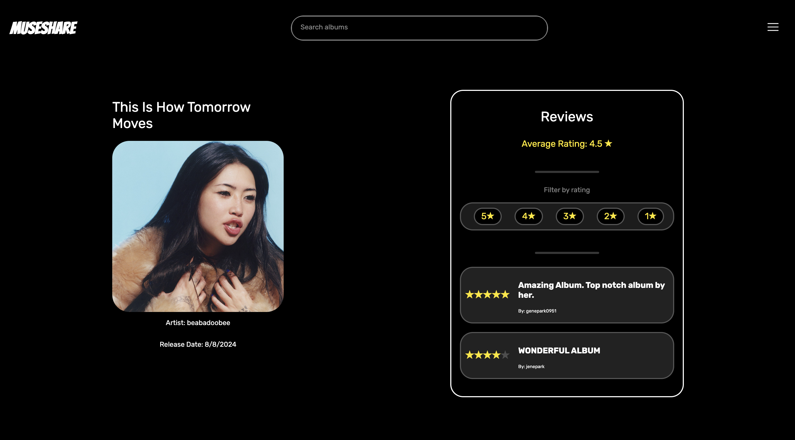
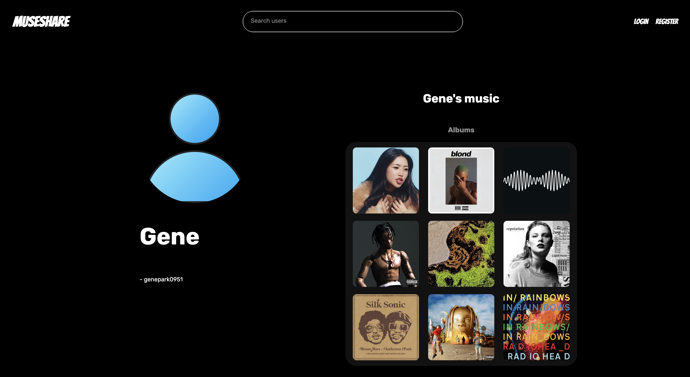

# MuseShare


This is my 25w DALI lab Developer Challenge (API Challenge)

Deployed URL: [MuseShare](https://museshare.onrender.com/)

MuseShare is a web application designed for music enthusiasts to review their favorite albums, artists, and tracks. 
You can also view your friends and other user's reviews. It utilizes the MERN stack.

## Why did I make it?


I've always wanted to develop an application where people can share their opinions on
certain artists, albums, or tracks. They can simply say they're good or they go on a long explanation
of what a certain album symbolizes or what the song means. 

## Note!

In many instacnes, I've gotten a error from the youtube API because my API key is invalid or exhausted. However, time to time, it would work again. 
Similarly, because I am using the free Spotify API, I've had many instances where the application doesn't work because of api key exahustion. If you 
experience this problem, please give it some time to try it again. 

## Features

- **User Authentication**: Users can register, log in, and manage their profiles. Used firebase.
  
- **Music Reviews**: Users can create and share reviews for albums, artists, and tracks.
  
  
- **Dynamic Content**: The application fetches data from a backend server, allowing users to view and interact with the latest music reviews.
- **Responsive Design**: The app is designed to be mobile-friendly, ensuring a good user experience across devices.

## Technologies Used

- **Frontend**: 
  - React
  - Vite
  - React Router for navigation
  - Axios for API calls
  - Youtube API
  - Spotify API (Just within the song review pages)

- **Backend**: 
  - Node.js
  - Express
  - MongoDB for data storage
  - Firebase
 


## Getting Started

To get started with MuseShare, follow these steps:

1. Clone the repository:
   ```
   git clone <repository-url>
   ```

2. Navigate to the client directory and install dependencies:
   ```
   cd client
   npm install
   ```
   Also make sure to change baseURL in the controllers to something like localhost:3000/ and then whatever comes next. 

4. Navigate to the server directory and install dependencies:
   ```
   cd server
   npm install
   ```

5. Set up your environment variables in a `.env` file in the server directory.
   Needed variables:
     ```
      PORT
      MONGODB_URI
      SPOTIFY_CLIENT_ID
      SPOTIFY_CLIENT_SECRET
      FIREBASE_API_KEY
      FIREBASE_AUTH_DOMAIN
      FIREBASE_PROJECT_ID
      FIREBASE_STORAGE_BUCKET
      FIREBASE_MESSAGING_SENDER_ID
      FIREBASE_APP_ID
      YOUTUBE_API_KEY
     ```

7. Start the backend server:
   ```
   npm run dev
   ```

8. In a new terminal, start the frontend:
   ```
   cd client
   npm run dev
   ```
   
## Navigating the Website
On the bottom right, there is + icon, where you can search aritsts, albums, and songs and leave reviews. On the top, there is also a search bar where you can see the reviews and other users as well. Try to find me. On top right inside the hamburger menu, there is a profile option that shows your reviewed music. 


## Learning Journey  

This was the biggest project I've ever developed, and it was my first time using the MERN stack at such a large scale. Before this, my experience was mostly with smaller projects, like a note-taking app and a phonebook application—both much simpler in scope. While I had prior experience with HTML, CSS, and JavaScript, I only started learning React and full-stack web development toward the end of last fall. It wasn’t until winterim that I really immersed myself in it.  

Looking back at my older projects and DALI app submissions, the difference in both functionality and style is drastic. Throughout this project, I’ve learned so much. This was my first time implementing Firebase Authentication, and I also picked up better styling techniques and small efficiency tricks that will speed up my workflow in the future. For instance, early on, I was calling API requests directly within components instead of through a controller. It wasn’t until later that I realized the need to restructure it, which led to a lot of backtracking. In hindsight, I also could have named things more clearly. While I have some experience with ESLint, I didn’t have enough time to implement it for this project—but that’s something I plan to improve on.  

---

## Looking Forward  

I have a lot of aspirations for this project.  

- I want users to be able to befriend each other and display their friends' reviews on the Home page so they can see what their friends are listening to.  
- I’d love to add lyrics to the track views, allowing users to highlight sections they want to discuss.  
- Improving spacing and placement throughout the site. 
- I plan to build a proper landing page for users who aren’t logged in and create a more personalized homepage for active users. Instead of displaying three random reviews and three personal reviews, I’d like to refine this layout and add filtering options.  
- Since this is an entertainment site, I also want to focus more on aesthetics—adding  animations and improving the overall design to give it a modern style. 


